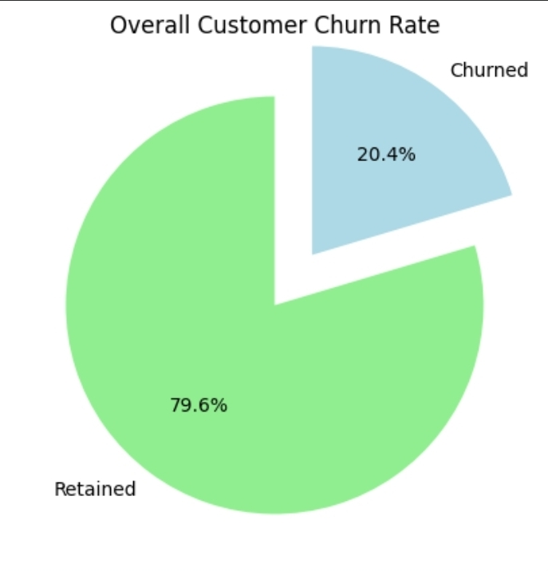
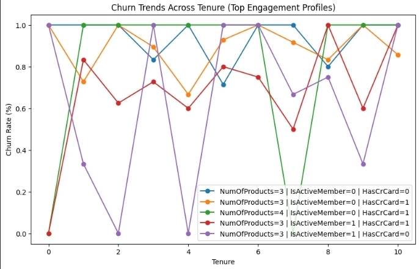

# Customer Segmentation & Churn Pattern Analytics in European Banking
### Overview
This project focuses on analyzing dataset to identify key factors influencing customer churn. Using exploratory data analysis (EDA) and customer segmentation techniques, the project uncovers patterns related to demographics, financial status and engagement levels.
The goal is to provide actionable insights that help banks improve customer retention strategies and reduce churn.

### Objectives
- Measure overall churn rate
- Identify churn distribution across customer segments
- Compare churn behavior across European regions
### Secondary Objectives
- Understand among high-value customers
- Evaluate tenure and engagement patterns
- Support strategic planning and marketing decisions
### Dataset Description
|          Column             |                  Description            |
|-----------------------------|-----------------------------------------|
|        CustomerId           |          Unique Customer Identifier     |
|         Surname             |               Customer Surname          |
|        CreditScore          |          Customer Creditworthiness      |
|        Geography            |            France, Spain, Germany       |
|         Gender              |                Male/ Female             |
|          Age                |                Customer age             |
|         Tenure              |             Years with the bank         |
|        Balance              |                Account Balance          |
|       NumOfProducts         |            Number of bank products      |
|       HasCrCard             |             Credit Card Ownership       |
|       IsActiveMember        |              Activity Indicator         |
|       EstimatedSalary       |            Estimated Annual Salary      |
|         Exited              |             Churn Indicator (Target)    |

### Key Analysis Performed
#### Customer Segmentation
Customers were segmented based on:
- Age Groups (<30, 30-45, 46-60, 60+)
- Balance Categories (Zero, Low, High)
- Credit Risk Levels (Low, Medium, High)
- Product Usage (Single, Two, Multiple)
- Engagement Level (Active vs Inactive)
#### Churn Analysis
- Overall churn rate calculated
- 
- Churn distribution across demographics and financial features
- Identification of high-risk customer segments
#### Trend Analysis
- Churn trends across tenure
- 
- Multi-dimensional segmentation (Products+ Activity + Card usage)
- Behavioral pattern discovery
### Key Insights
- High balance customers show higher churn risk
-  Female customers have a higher churn rate than males
-  Germany has the highest churn among all regions
-  Customers aged 46-60 are most likely to churn
-  Customers with multiple products show extreme churn behavior
-  Inactive users are more prone to churn
# Business Recommendations
- Implement loyalty programs for high-value customers
- Increase engagement strategies for inactive users
- Promote bundled product offerings
- Focus retention campaigns on high-risk regions
- Personalize services for middle-aged customer

# Tech Stack
- Python
- Pandas-Data manipulation
- Matplotlib/Plotly-Visualization
- Streamlit-Interactive dashboard

# Dashboard Features
- KPI Metrics (Churn Rate, Risk Score, Engagement)
- Customer Segmentation Explorer
- High-Value Customer Churn Analysis
- Interactive filters (Age, Balalnce, Geography, etc.)
- Trend analysis charts

# Conclusion
This project demonstrates how customer segmentation and exploratory analysis can effectively identify churn patterns. By combining data insights with business strategies, banks can proactively reduce churn and improve customer satisfaction.
